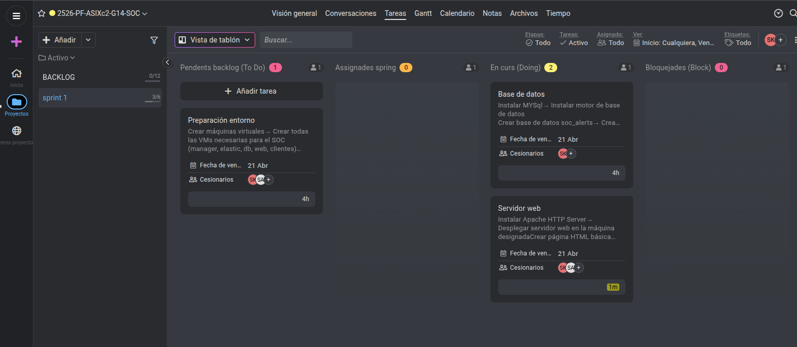

# Acta Sprint 1 - SOC Security

## Fecha
21/04/2026

## Participantes

| Rol | Nombre |
|-----|--------|
| **Scrum Master** | Spandan |
| **Product Owner** | Anmolpreet |

---

## Desarrollo del Acta

El día 21/04/2026 hemos realizado la primera acta de seguimiento para nuestro proyecto SOC Security. En esta acta hemos revisado el progreso del Sprint 1 y decidimos incluir estas tareas como base del proyecto.

Los trabajos definidos son:

### Diagrama de arquitectura
Diseñar el esquema de red del SOC con todas las máquinas virtuales (servidor web, base de datos, servidor SOC, agentes monitorizados) y las conexiones entre ellas.

### Estructura de documentación en Git
Crear la estructura de carpetas (actas-scrum/, arquitectura/, configuracion/, scripts/, imagenes/, sprints/ ) y los archivos Markdown principales.

### Backlog en ProofHub
Desglosar el proyecto en tareas y añadirlas al backlog de ProofHub, organizándolas por estado (To Do, Doing, Done).

### Preparación del entorno
Crear todas las máquinas virtuales necesarias en IsardVDI para el SOC (manager, Elasticsearch, base de datos, servidor web, clientes monitorizados).

### Servidor web Apache
Instalar Apache HTTP Server en la máquina designada y crear una página HTML básica que será monitorizada por el SOC.

### Base de datos MySQL
Instalar MySQL, crear la base de datos `soc_alerts` y la tabla `alerts` para almacenar las alertas generadas por Wazuh.

---

## Estado del ProofHub durante el Sprint

A continuación, se muestramos el estado de nuestro backlog en ProofHub durante el Sprint 1:

