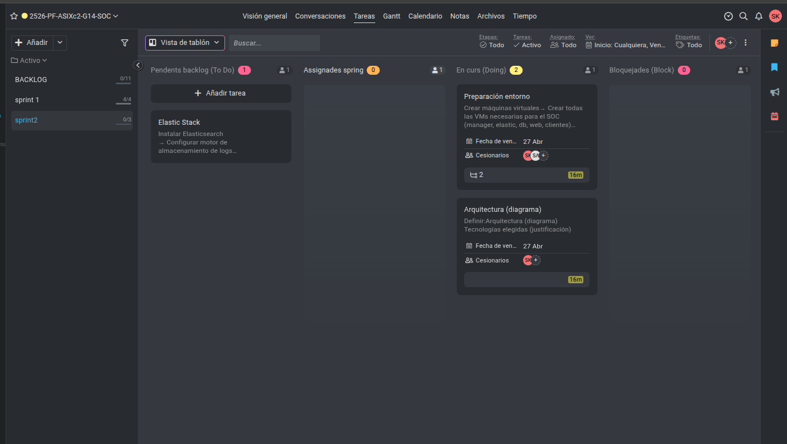

# Acta Sprint 2 - SOC Security

## Fecha
04/05/2026

## Participantes

| Rol | Nombre |
|-----|--------|
| Scrum Master | Spandan |
| Product Owner | Anmolpreet |

---

## Desarrollo del Acta

El día 27/04/2026 hemos realizado la segunda acta de seguimiento para nuestro proyecto SOC Security. En esta acta comprobamos si habíamos completado todas las tareas del sprint 1 o no, y si no estaban completadas, las movimos al sprint 2.

En este sprint final hemos definido las tareas pendientes para completar el proyecto SOC Security. Las tareas se organizan en las siguientes categorías:

- **Estado inicial de nuestro ProofHub**

---

## Tareas del Sprint 2

### Wazuh
- Instalar Wazuh Manager
- Configurar sistema central de monitorizacion

### Agentes
- Instalar agentes en clientes
- Desplegar agentes en las 4 maquinas monitorizadas
- Registrar agentes en Wazuh Manager

### Logs
- Instalar Filebeat
- Configurar envio de logs desde clientes
- Definir rutas de logs a monitorizar

### Integracion DB
- Crear script de extraccion de alertas
- Leer alertas generadas por Wazuh
- Insertar alertas en MySQL

### Web completa
- Conectar web con base de datos
- Permitir acceso a datos desde la web

### Automatizacion
- Crear script de estado de agentes
- Detectar si los agentes estan activos o caidos

### Pruebas reales
- Escaneo con Nmap
- Simular reconocimiento de red
- Ataque de fuerza bruta SSH

### Red y conectividad
- Asignar IPs estaticas
- Configurar IP fija en cada maquina para evitar problemas de conexion

### Backups
- Crear script de backup de MariaDB
- Generar copias de seguridad de la base de datos

### Seguridad
- Configurar firewall
- Limitar acceso a puertos necesarios
- Configurar SSH seguro

### Validacion SOC
- Generar eventos de prueba
- Crear actividad (logins, errores) para generar logs
- Verificar alertas en Wazuh

---

---
## Proximos Pasos

Completar todas las tareas definidas en este sprint para finalizar el proyecto SOC Security.

---

*Documentado por: Anmolpreet Singh Kaur & Spandan Khadka*
*Fecha: 04/05/2026*