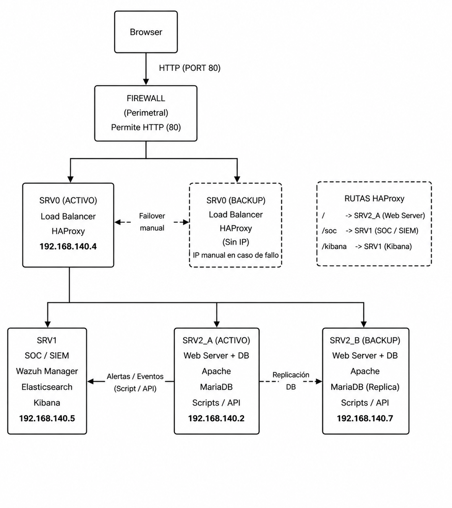

## Explicacion del Diagrama de Arquitectura del Proyecto SOC Security

En este diagrama podemos ver que el usuario accede a la pagina web via HTTP en el puerto 80. El firewall perimetral permite unicamente el trafico HTTP hacia el balanceador de carga activo (HAProxy en SRV0 con IP 192.168.140.4). HAProxy enruta las peticiones hacia el servidor web activo (SRV2_A en 192.168.140.2), que ejecuta Apache y MariaDB. Si SRV2_A falla, HAProxy redirige el trafico al servidor web de respaldo (SRV2_B en 192.168.140.7). El servidor SOC (SRV1 en 192.168.140.5) ejecuta Wazuh Manager, Elasticsearch y Kibana para la monitorizacion y generacion de alertas.

- [Index](../Index.md)
