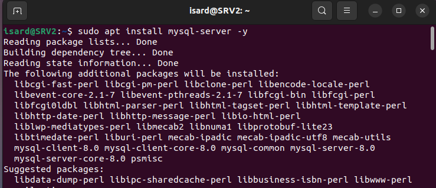
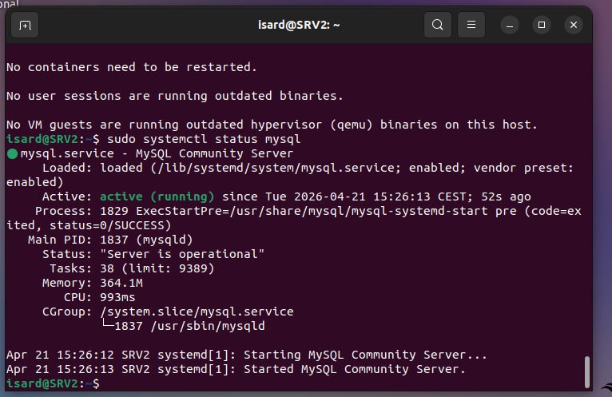
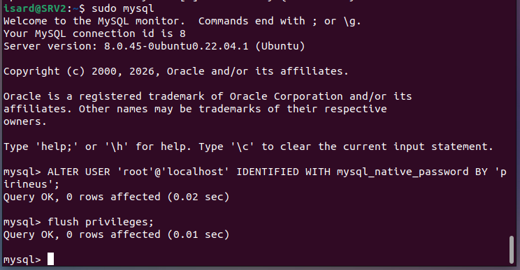
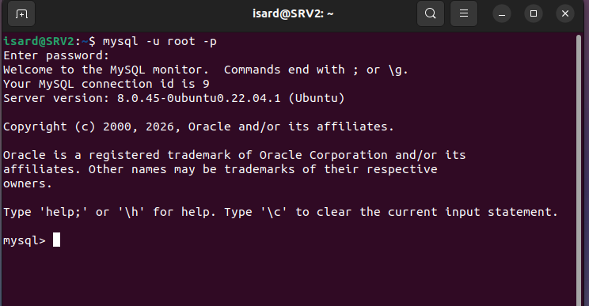
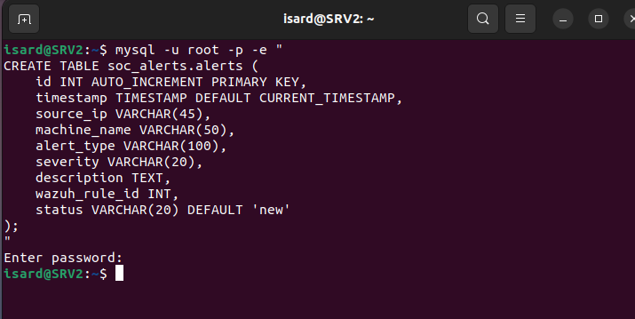
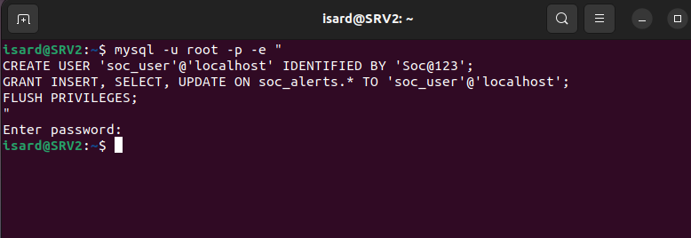

Here is the **complete documentation in Spanish** for the MySQL database setup, with simple explanations of each command:

```markdown
# Instalación y Configuración de MySQL para el SOC

## Objetivo

Instalar una base de datos MySQL para almacenar las alertas generadas por Wazuh. Así podremos consultarlas desde nuestro panel HTML personalizado.

---

## Paso 1: Instalar MySQL

### Comando:
```bash
sudo apt install mysql-server -y
```




## Paso 2: Verificar que MySQL está funcionando

### Comando:
```bash
sudo systemctl status mysql
```




## Paso 3: Entrar a MySQL como root (sin contraseña)

### Comando:
```bash
sudo mysql
```



---

## Paso 4: Cambiar la contraseña del usuario root

### Comando (dentro de MySQL):
```sql
ALTER USER 'root'@'localhost' IDENTIFIED WITH mysql_native_password BY 'TuContraseñaAquí';
FLUSH PRIVILEGES;
```


### ¿Qué hace?
- Establece una contraseña para el usuario root
- `FLUSH PRIVILEGES` guarda los cambios

### Ejemplo:
```sql
ALTER USER 'root'@'localhost' IDENTIFIED WITH mysql_native_password BY 'SocRoot123!';
FLUSH PRIVILEGES;
```

### ¿Qué puede pasar?
- **Importante:** ¡No olvides esta contraseña!
- Si la pierdes, tendrás que reiniciar MySQL en modo seguro

---

## Paso 5: Salir de MySQL

### Comando:
```sql
exit;
```

### ¿Qué hace?
Cierra la consola de MySQL y vuelve al terminal normal.

---

## Paso 6: Probar la nueva contraseña de root

### Comando:
```bash
mysql -u root -p
```



### ¿Qué hace?
Intenta entrar a MySQL con el usuario root. Te pedirá la contraseña.

### ¿Qué puede pasar?
- Si la contraseña es correcta, entras a MySQL
- Si es incorrecta, da error `ACCESS DENIED`

---

## Paso 7: Crear la base de datos para las alertas

### Comando:
```bash
mysql -u root -p -e "CREATE DATABASE soc_alerts;"
```


### ¿Qué hace?
- `-u root` → usa el usuario root
- `-p` → pide contraseña
- `-e` → ejecuta un comando SQL
- Crea una base de datos llamada `soc_alerts`

### ¿Qué puede pasar?
- Si ya existe, dará error
- Los nombres de bases de datos pueden ser sensibles a mayúsculas

---

## Paso 8: Verificar que la base de datos se creó

### Comando:
```bash
mysql -u root -p -e "SHOW DATABASES;"
```


### ¿Qué hace?
Muestra todas las bases de datos existentes.

### Resultado esperado:
```
soc_alerts          ← debe aparecer aquí
```

---

## Paso 9: Crear la tabla de alertas

### Comando:
```bash
mysql -u root -p -e "
CREATE TABLE soc_alerts.alerts (
    id INT AUTO_INCREMENT PRIMARY KEY,
    timestamp TIMESTAMP DEFAULT CURRENT_TIMESTAMP,
    source_ip VARCHAR(45),
    machine_name VARCHAR(50),
    alert_type VARCHAR(100),
    severity VARCHAR(20),
    description TEXT,
    wazuh_rule_id INT,
    status VARCHAR(20) DEFAULT 'new'
);
"
```

### ¿Qué hace?
Crea una tabla llamada `alerts` dentro de la base de datos `soc_alerts`.

### Explicación de cada campo:

| Campo | Tipo | ¿Qué guarda? |
|-------|------|---------------|
| `id` | Número | Identificador único de cada alerta (automático) |
| `timestamp` | Fecha/Hora | Cuándo ocurrió el ataque |
| `source_ip` | Texto (45 letras) | IP del atacante |
| `machine_name` | Texto (50 letras) | Qué máquina fue atacada |
| `alert_type` | Texto (100 letras) | Tipo de ataque (escaneo, fuerza bruta, etc.) |
| `severity` | Texto (20 letras) | Gravedad: Crítica, Alta, Media, Baja |
| `description` | Texto largo | Detalles del ataque |
| `wazuh_rule_id` | Número | ID de la regla de Wazuh que detectó el ataque |
| `status` | Texto (20 letras) | Estado: nueva, investigando, resuelta |

---




## Paso 10: Verificar la estructura de la tabla

### Comando:
```bash
mysql -u root -p -e "DESCRIBE soc_alerts.alerts;"
```


### ¿Qué hace?
Muestra todos los campos de la tabla y sus tipos de datos.

---

## Paso 11: Crear un usuario para la aplicación

### Comando:
```bash
mysql -u root -p -e "
CREATE USER 'soc_user'@'localhost' IDENTIFIED BY 'Soc@123';
GRANT INSERT, SELECT, UPDATE ON soc_alerts.* TO 'soc_user'@'localhost';
FLUSH PRIVILEGES;
"
```




### ¿Qué hace?
- `CREATE USER` → Crea un usuario nuevo (no root)
- `IDENTIFIED BY` → Asigna una contraseña
- `GRANT` → Da permisos específicos
- `FLUSH PRIVILEGES` → Guarda los cambios

### Permisos que damos:

| Permiso | ¿Qué permite? |
|---------|----------------|
| `INSERT` | Añadir nuevas alertas |
| `SELECT` | Leer/consultar alertas |
| `UPDATE` | Modificar alertas (ej: cambiar estado) |

### ¿Qué NO permite?
- `DELETE` → No puede borrar alertas
- `DROP` → No puede borrar tablas

### ¿Qué puede pasar?
- El usuario solo puede acceder a `soc_alerts`
- Es más seguro que usar root

---

## Paso 12: Probar el nuevo usuario

### Comando:
```bash
mysql -u soc_user -p -e "SELECT * FROM soc_alerts.alerts;"
```


l_test_soc_user.png)


### ¿Qué hace?
Intenta entrar como `soc_user` y mostrar las alertas.

---

## Resumen de Credenciales

| Campo | Valor |
|-------|-------|
| **Base de datos** | `soc_alerts` |
| **Tabla** | `alerts` |
| **Usuario root** | `root` |
| **Contraseña root** | `pirineus` |
| **Usuario SOC** | `soc_user` |
| **Contraseña SOC** | `Soc@123` |

---

## Comandos Útiles para el Día a Día

| Qué quiero hacer | Comando |
|------------------|---------|
| Entrar a MySQL como root | `mysql -u root -p` |
| Ver todas las bases de datos | `SHOW DATABASES;` |
| Ver todas las tablas | `SHOW TABLES FROM soc_alerts;` |
| Ver todas las alertas | `SELECT * FROM soc_alerts.alerts;` |
| Ver alertas sin formato | `SELECT * FROM soc_alerts.alerts\G` |
| Contar cuántas alertas hay | `SELECT COUNT(*) FROM soc_alerts.alerts;` |
| Salir de MySQL | `exit;` |

---

- [Index](../Index.md)
