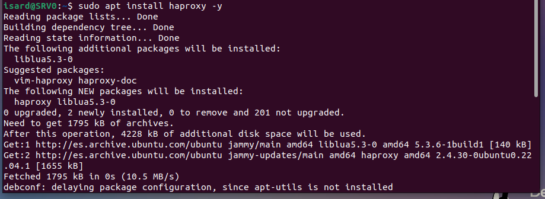
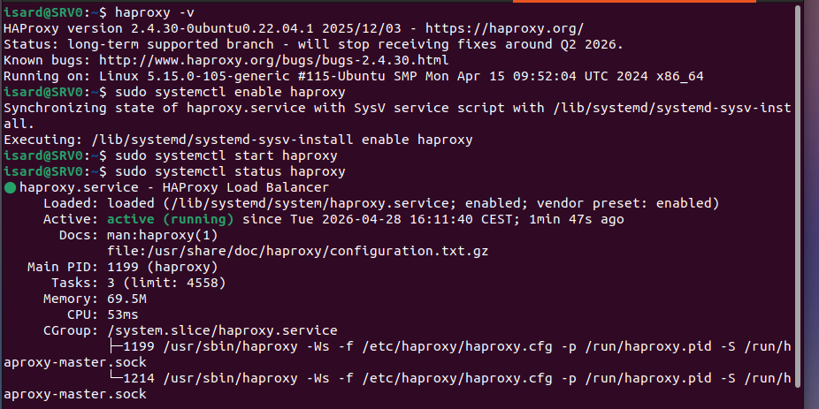
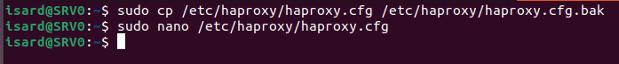
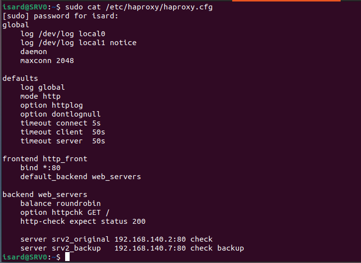

```markdown
# Configuración del Load Balancer HAProxy (SRV0)

## Imagen 1 - Instalación de HAProxy

**Donde se ejecuta:** Servidor Load Balancer (SRV0 - 192.168.140.4)

**Comando:**
```bash
sudo apt install haproxy -y
```

**Que estamos haciendo:**
Instalando HAProxy en el servidor load balancer (SRV0). HAProxy será el encargado de distribuir el tráfico entre los servidores web principal y backup, y también redirigirá las peticiones al servidor SOC cuando sea necesario.



---

## Imagen 2 - Verificación de la instalación y arranque del servicio

**Donde se ejecuta:** Servidor Load Balancer (SRV0 - 192.168.140.4)

**Comandos:**
```bash
haproxy -v
sudo systemctl enable haproxy
sudo systemctl start haproxy
sudo systemctl status haproxy
```

**Que estamos haciendo:**
Verificamos que HAProxy se ha instalado correctamente con `haproxy -v` (versión 2.4.30). Luego habilitamos el servicio para que arranque automáticamente con el sistema con `systemctl enable`. Arrancamos el servicio con `systemctl start` y comprobamos que está activo y corriendo con `systemctl status`. El estado muestra "active (running)" lo que indica que HAProxy funciona correctamente.



---

## Imagen 3 - Copia de seguridad y edición del archivo de configuración

**Donde se ejecuta:** Servidor Load Balancer (SRV0 - 192.168.140.4)

**Comandos:**
```bash
sudo cp /etc/haproxy/haproxy.cfg /etc/haproxy/haproxy.cfg.bak
sudo nano /etc/haproxy/haproxy.cfg
```

**Que estamos haciendo:**
Primero creamos una copia de seguridad del archivo de configuración original de HAProxy con `sudo cp`. Esto nos permite recuperar la configuración anterior si algo sale mal. Luego editamos el archivo de configuración `haproxy.cfg` con nano para definir los servidores web (principal y backup), las rutas de redirección y los puertos de escucha.



---

## Contenido del archivo de configuración (haproxy.cfg)

**Donde se ejecuta:** Servidor Load Balancer (SRV0 - 192.168.140.4)

**Archivo:** `/etc/haproxy/haproxy.cfg`

**Comando para ver el contenido:**
```bash
sudo cat /etc/haproxy/haproxy.cfg
```

**Que estamos haciendo:**
A continuación se muestra el contenido del archivo de configuración que hemos creado para HAProxy. En este archivo definimos los servidores web (SRV2_A como principal y SRV2_B como backup), el puerto de escucha (80), y las reglas de balanceo.



---

## Resumen de Comandos por Servidor

| Servidor | IP | Comandos ejecutados |
|----------|-----|---------------------|
| **SRV0 (Load Balancer)** | 192.168.140.4 | `apt install haproxy`, `haproxy -v`, `systemctl enable haproxy`, `systemctl start haproxy`, `systemctl status haproxy`, `cp`, `nano`, `cat` |

---

## Archivos de Configuración Modificados

| Archivo | Propósito |
|---------|-----------|
| `/etc/haproxy/haproxy.cfg` | Configuración principal de HAProxy (frontend, backend, servidores) |
| `/etc/haproxy/haproxy.cfg.bak` | Copia de seguridad de la configuración original |

---

*Documentado por: Anmolpreet Singh Kaur & Spandan Khadka*
*Fecha: 04/05/2026*

- [Index](../Index.md)
