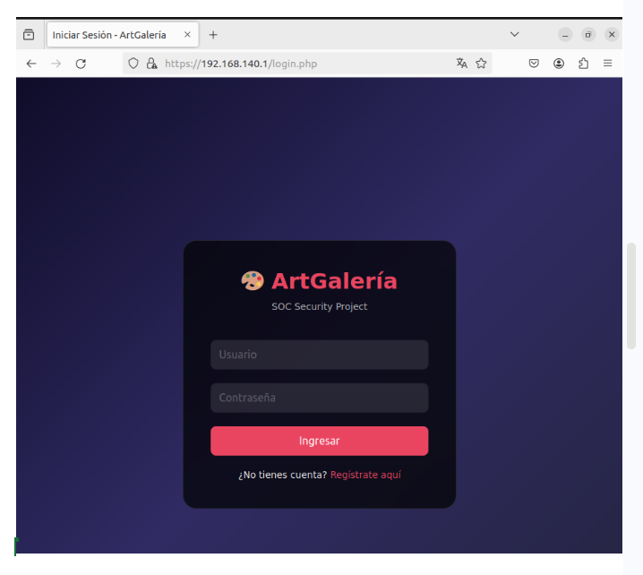

# Configuración del Firewall Perimetral

## ¿Qué es este firewall?

Este firewall es una máquina dedicada que actúa como puerta de entrada a toda nuestra infraestructura. Solo permite el tráfico que nosotros autorizamos y bloquea el resto. Está situada al principio de la red, antes del HAProxy.

---

## Activación del reenvío de IP (IP Forwarding)

**Donde se ejecuta:** Servidor Firewall

**Archivo modificado:** `/etc/sysctl.conf`

**Línea descomentada:**
```bash
net.ipv4.ip_forward=1
```

**Qué estamos haciendo:**
Activamos el reenvío de paquetes IP en el firewall. Esto permite que el firewall actúe como un router y pueda redirigir el tráfico desde la red externa hacia los servidores internos (HAProxy, web, SOC, etc.). Sin esta opción, el firewall no podría enviar el tráfico a las otras máquinas.

---

## Aplicación de los cambios de red

**Donde se ejecuta:** Servidor Firewall

**Comando:**
```bash
sudo sysctl -p
```

**Salida:**
```
net.ipv4.ip_forward = 1
```

**Qué estamos haciendo:**
Aplicamos los cambios de configuración de red sin necesidad de reiniciar el sistema. El comando `sysctl -p` carga la configuración del archivo `/etc/sysctl.conf`. Verificamos que el reenvío de IP está activado consultando el archivo `/proc/sys/net/ipv4/ip_forward`, que muestra `1` (activado).

---

## Instalación de UFW (Uncomplicated Firewall)

**Donde se ejecuta:** Servidor Firewall

**Comando:**
```bash
sudo apt install -y ufw
```

**Qué estamos haciendo:**
Instalamos UFW, que es una herramienta sencilla para configurar el firewall en Linux. UFW facilita la creación de reglas sin tener que escribir comandos complejos de iptables directamente.

---

## Configuración de políticas por defecto

**Donde se ejecuta:** Servidor Firewall

**Comandos:**
```bash
sudo ufw default deny incoming
sudo ufw default allow outgoing
```

**Qué estamos haciendo:**
Establecemos las reglas por defecto del firewall:
- **Deny incoming:** Bloqueamos todo el tráfico que viene del exterior. Solo permitiremos lo que explícitamente autorizamos.
- **Allow outgoing:** Permitimos todo el tráfico que sale desde nuestros servidores hacia fuera.

**Error en la imagen:** Aparece `ufv` en lugar de `ufw` en algunos comandos. El comando correcto es `ufw`.

---

## Reglas de redirección de puertos (DNAT) para HTTPS

**Donde se ejecuta:** Servidor Firewall

**Archivo modificado:** `/etc/ufw/before.rules`

**Reglas añadidas:**
```bash
*nat
:PREROUTING ACCEPT [0:0]
:POSTROUTING ACCEPT [0:0]

-A PREROUTING -i enp2s0 -p tcp --dport 443 -j DNAT --to-destination 192.168.140.4:443
-A POSTROUTING -o enp2s0 -j MASQUERADE

COMMIT
```

**Qué estamos haciendo:**
Configuramos el firewall para redirigir (forward) el tráfico web hacia el HAProxy. Estas reglas hacen que:
- El tráfico que llega al puerto 443 (HTTPS) se redirija automáticamente al HAProxy en `192.168.140.4:443`
- La regla `MASQUERADE` oculta las IPs internas para que los paquetes puedan salir a internet correctamente

---

## Permitir el reenvío de tráfico web hacia HAProxy

**Donde se ejecuta:** Servidor Firewall

**Comando:**
```bash
sudo ufw route allow in on enp2s0 out on enp2s0 to 192.168.140.4 port 443 proto tcp
```

**Qué estamos haciendo:**
Permitimos explícitamente que el firewall pueda reenviar tráfico web (puerto 443) hacia el HAProxy. La opción `route allow` es necesaria para que UFW permita el reenvío de paquetes entre interfaces de red.

---

## Verificación de que la página web es accesible

**Donde se visualiza:** Navegador web

**Elemento distintivo:**
```
ArtGalería
SOC Security Project
Usuario
Contraseña
Ingresar
```

**Qué estamos haciendo:**
Verificamos desde un navegador externo que la página web es accesible a través del firewall. Vemos el formulario de inicio de sesión de nuestra galería de arte, lo que confirma que el firewall está redirigiendo correctamente el tráfico HTTPS hacia el HAProxy y este a su vez al servidor web.

---

## Configuración de redirección SSH a diferentes máquinas

**Donde se ejecuta:** Servidor Firewall

**Archivo modificado:** `/etc/ufw/before.rules`

**Reglas añadidas:**
```bash
-A PREROUTING -i enp2s0 -p tcp --dport 2221 -j DNAT --to-destination 192.168.140.5:22
-A PREROUTING -i enp2s0 -p tcp --dport 2222 -j DNAT --to-destination 192.168.140.2:22
-A PREROUTING -i enp2s0 -p tcp --dport 2223 -j DNAT --to-destination 192.168.140.7:22
-A PREROUTING -i enp2s0 -p tcp --dport 2224 -j DNAT --to-destination 192.168.140.4:22
-A PREROUTING -i enp2s0 -p tcp --dport 2225 -j DNAT --to-destination 192.168.140.10:22
```

**Qué estamos haciendo:**
Configuramos el firewall para redirigir conexiones SSH a diferentes máquinas internas usando puertos distintos. Esto nos permite acceder por SSH a cada servidor desde fuera usando un puerto específico:

| Puerto externo | Destino interno |
|----------------|-----------------|
| 2221 | SRV1 (SOC) - 192.168.140.5:22 |
| 2222 | SRV2_A (Web principal) - 192.168.140.2:22 |
| 2223 | SRV2_B (Web backup) - 192.168.140.7:22 |
| 2224 | SRV0 (HAProxy principal) - 192.168.140.4:22 |
| 2225 | SRV0BAK (HAProxy backup) - 192.168.140.10:22 |

---

## Apertura de puertos SSH en el firewall

**Donde se ejecuta:** Servidor Firewall

**Comandos:**
```bash
sudo ufw allow 2221/tcp
sudo ufw allow 2222/tcp
sudo ufw allow 2223/tcp
sudo ufw allow 2224/tcp
sudo ufw allow 2225/tcp
```

**Qué estamos haciendo:**
Abrimos los puertos 2221 al 2225 en el firewall para permitir conexiones SSH desde el exterior. Cada puerto está asociado a una máquina interna diferente, como se explica en la imagen anterior.

---

## Reglas de ruta para SSH hacia cada máquina

**Donde se ejecuta:** Servidor Firewall

**Comandos:**
```bash
sudo ufw route allow in on enp2s0 out on enp2s0 to 192.168.140.5 port 22 proto tcp
sudo ufw route allow in on enp2s0 out on enp2s0 to 192.168.140.2 port 22 proto tcp
sudo ufw route allow in on enp2s0 out on enp2s0 to 192.168.140.7 port 22 proto tcp
sudo ufw route allow in on enp2s0 out on enp2s0 to 192.168.140.4 port 22 proto tcp
sudo ufw route allow in on enp2s0 out on enp2s0 to 192.168.140.10 port 22 proto tcp
```

**Qué estamos haciendo:**
Permitimos el reenvío de tráfico SSH desde la interfaz externa hacia cada una de las máquinas internas. Estas reglas trabajan junto con las reglas DNAT para que las conexiones SSH lleguen a su destino correcto.



---


## Resumen de las reglas del firewall

| Puerto externo | Acción | Destino interno | Servicio |
|----------------|--------|-----------------|----------|
| 443 | REENVIAR | 192.168.140.4:443 | Web (HTTPS) |
| 2221 | REENVIAR | 192.168.140.5:22 | SSH a SRV1 (SOC) |
| 2222 | REENVIAR | 192.168.140.2:22 | SSH a SRV2_A (Web principal) |
| 2223 | REENVIAR | 192.168.140.7:22 | SSH a SRV2_B (Web backup) |
| 2224 | REENVIAR | 192.168.140.4:22 | SSH a SRV0 (HAProxy principal) |
| 2225 | REENVIAR | 192.168.140.10:22 | SSH a SRV0BAK (HAProxy backup) |

---

## Esquema de funcionamiento del firewall

```
                    ┌─────────────────────────────────────────────────────────┐
                    |                     INTERNET                            |
                    |                          │                              |
                    │                          │ Usuario intenta acceder      │
                    │                          ▼                              │
                    │              ┌─────────────────────┐                    │
                    │              │     FIREWALL        │                    │
                    │              │  (Máquina dedicada) │                    │
                    │              │                     │                    │
                    │              │  Reglas:            │                    │
                    │              │  - Puerto 443 → HAProxy                 │
                    │              │  - Puerto 222x → SSH a cada máquina     │
                    │              │  - Todo lo demás → DENEGADO             │
                    │              └─────────┬───────────┘                    │
                    │                        │                                │
                    │        ┌───────────────┼───────────────┐                │
                    │        │               │               │                │
                    │        ▼               ▼               ▼                │
                    │   ┌─────────┐    ┌─────────┐    ┌─────────┐             │
                    │   │ HAProxy │    │  SRV1   │    │  SRV2   │             │
                    │   │  .4     │    │  (SOC)  │    │ (Web)   │             │
                    │   └─────────┘    └─────────┘    └─────────┘             │
                    │                                                         │
                    └─────────────────────────────────────────────────────────┘
```

---

## Comandos útiles para el firewall

| Acción | Comando |
|--------|---------|
| Ver estado del firewall | `sudo ufw status verbose` |
| Recargar reglas | `sudo ufw reload` |
| Ver reglas de reenvío | `sudo ufw status numbered` |
| Desactivar firewall (solo para pruebas) | `sudo ufw disable` |
| Activar firewall | `sudo ufw enable` |

---

## Configuración del Firewall en HAProxy (SRV0)

Además del firewall perimetral, también configuramos un firewall en el propio servidor HAProxy para protegerlo directamente.

**Donde se ejecuta:** Servidor HAProxy (SRV0 - 192.168.140.4)

**Comandos:**
```bash
sudo ufw default deny incoming
sudo ufw default allow outgoing
sudo ufw allow from 192.168.140.1 to any port 22 proto tcp
sudo ufw allow from 192.168.140.1 to any port 443 proto tcp
sudo ufw enable
```

**Qué estamos haciendo:**
Configuramos el firewall en el servidor HAProxy para mayor seguridad:

| Regla | Significado |
|-------|-------------|
| `deny incoming` | Bloqueamos todo el tráfico que intente entrar al HAProxy |
| `allow outgoing` | Permitimos que el HAProxy pueda salir a internet |
| `allow from 192.168.140.1 to port 22` | Solo permitimos SSH desde la IP del firewall perimetral |
| `allow from 192.168.140.1 to port 443` | Solo permitimos HTTPS desde la IP del firewall perimetral |

**Ventajas de esta configuración:**
- El HAProxy solo acepta conexiones HTTPS y SSH desde el firewall
- Nadie puede acceder directamente al HAProxy desde internet
- Todo el tráfico debe pasar primero por el firewall perimetral
- Esto añade una capa extra de seguridad (defensa en profundidad)

**Esquema resultante:**
```
Internet → Firewall Perimetral → HAProxy (solo acepta del firewall) → Web Servers
```

---

*Documentado por: Anmolpreet Singh Kaur & Spandan Khadka*
*Fecha: 12/05/2026*


*Documentado por: Anmolpreet Singh Kaur & Spandan Khadka*
*Fecha: 12/05/2026*

- [Index](../Index.md)
