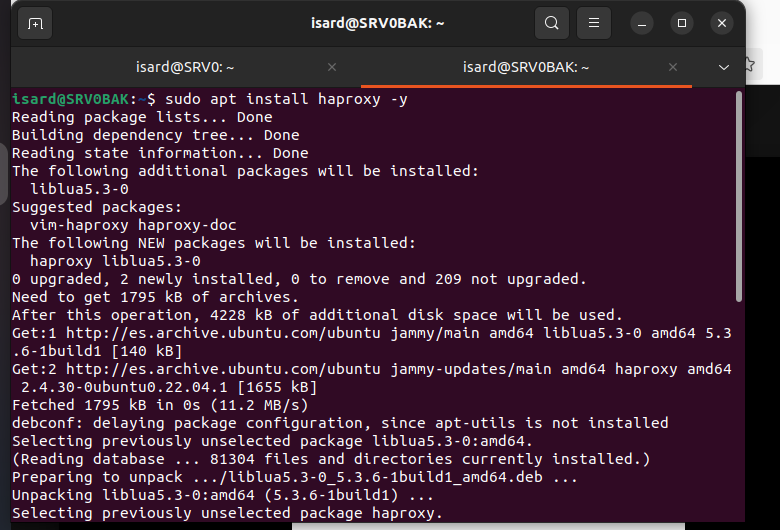
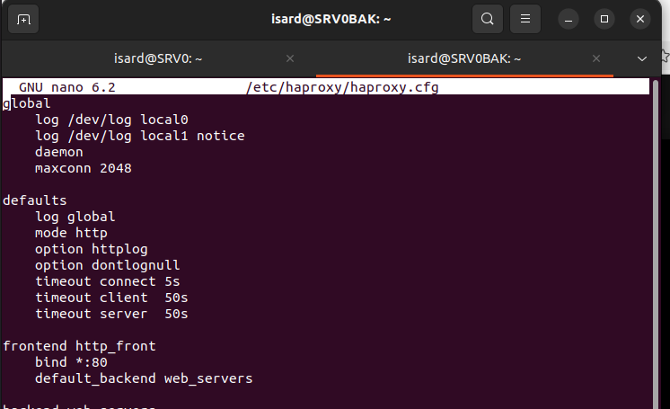
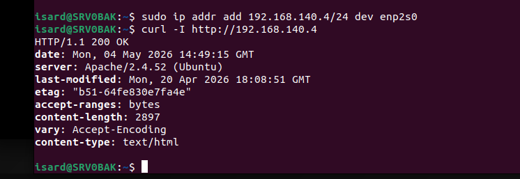
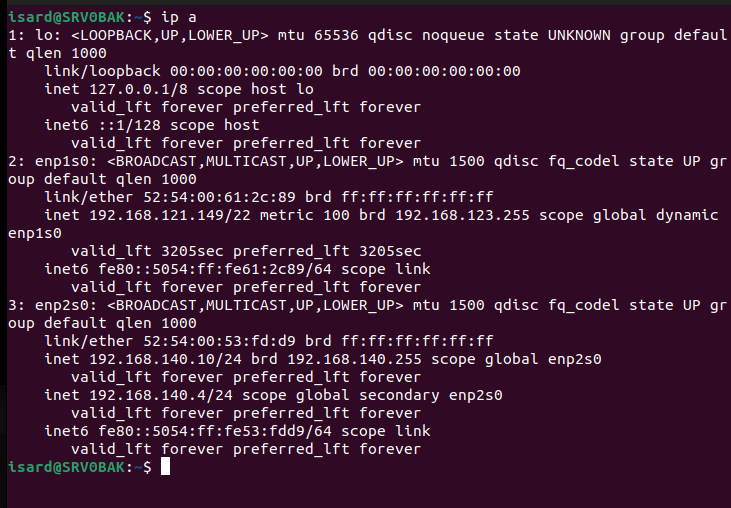
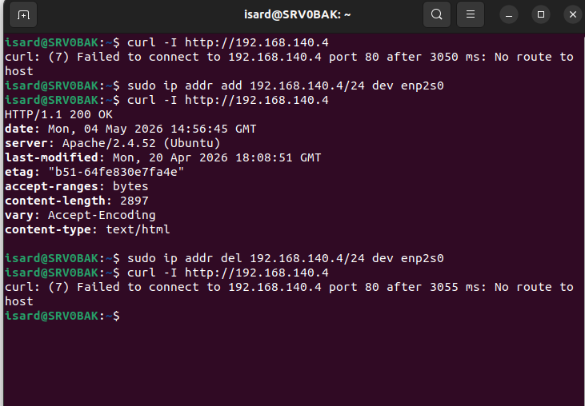

```markdown
# Configuración del Load Balancer Backup (SRV0BAK)

## Imagen 1 - Instalación de HAProxy en el servidor backup

**Donde se ejecuta:** Servidor Load Balancer Backup (SRV0BAK)

**Comando:**
```bash
sudo apt install haproxy -y
```

**Que estamos haciendo:**
Instalando HAProxy en el servidor load balancer de respaldo (SRV0BAK). Este servidor actuará como backup del load balancer principal. En caso de que el SRV0 activo falle, podremos activar manualmente este servidor para que asuma la IP y el servicio.



---

## Imagen 2 - Copia de seguridad de la configuración original

**Donde se ejecuta:** Servidor Load Balancer Backup (SRV0BAK)

**Comando:**
```bash
sudo cp /etc/haproxy/haproxy.cfg /etc/haproxy/haproxy.cfg.bak
```

**Que estamos haciendo:**
Creamos una copia de seguridad del archivo de configuración original de HAProxy antes de modificarlo. Esto nos permite restaurar la configuración anterior si algo sale mal durante la configuración del backup.


---

## Imagen 3 - Edición del archivo de configuración

**Donde se ejecuta:** Servidor Load Balancer Backup (SRV0BAK)

**Comando:**
```bash
sudo nano /etc/haproxy/haproxy.cfg
```

**Que estamos haciendo:**
Editamos el archivo de configuración `haproxy.cfg` para copiar la misma configuración que tiene el HAProxy activo. De esta forma, el backup tendrá las mismas reglas de balanceo y los mismos servidores web (SRV2_A y SRV2_B) que el load balancer principal.



---

## Imagen 4 - Configuración del archivo haproxy.cfg

**Donde se ejecuta:** Servidor Load Balancer Backup (SRV0BAK)

**Archivo:** `/etc/haproxy/haproxy.cfg`

**Contenido de la configuración:**
```bash
global
    log /dev/log local0
    log /dev/log local1 notice
    daemon
    maxconn 2048

defaults
    log global
    mode http
    option httplog
    option dontlognull
    timeout connect 5s
    timeout client 50s
    timeout server 50s

frontend http_front
    bind *:80
    default_backend web_servers
```

**Que estamos haciendo:**
Copiamos la configuración del HAProxy activo al backup. Esta configuración define los servidores web (SRV2_A como principal y SRV2_B como backup), el puerto de escucha (80), y las reglas de balanceo.


---

## Imagen 5 - Asignación manual de la IP activa y comprobación

**Donde se ejecuta:** Servidor Load Balancer Backup (SRV0BAK)

**Comandos:**
```bash
sudo ip addr add 192.168.140.4/24 dev enp2s0
curl -I http://192.168.140.4
```

**Que estamos haciendo:**
Simulamos un failover manual. Asignamos la IP del load balancer activo (192.168.140.4) al servidor backup usando `ip addr add`. Luego comprobamos con `curl` que la página web es accesible a través de esta IP, lo que confirma que el backup puede tomar el control si el activo falla.



---

## Imagen 6 - Verificación de la IP asignada

**Donde se ejecuta:** Servidor Load Balancer Backup (SRV0BAK)

**Comando:**
```bash
ip a
```

**Que estamos haciendo:**
Verificamos que la IP 192.168.140.4 se ha añadido correctamente a la interfaz `enp2s0`. En la salida del comando podemos ver que ahora el servidor backup tiene dos IPs: su IP original (192.168.140.10) y la IP del load balancer activo (192.168.140.4) como secundaria.



---

## Imagen 7 - Prueba completa de failover manual

**Donde se ejecuta:** Servidor Load Balancer Backup (SRV0BAK)

**Comandos:**
```bash
curl -I http://192.168.140.4
sudo ip addr add 192.168.140.4/24 dev enp2s0
curl -I http://192.168.140.4
sudo ip addr del 192.168.140.4/24 dev enp2s0
curl -I http://192.168.140.4
```

**Que estamos haciendo:**
Realizamos una prueba completa de failover manual:
1. Primero comprobamos que sin la IP asignada, no hay conexión (No route to host)
2. Asignamos la IP 192.168.140.4 al backup
3. Verificamos que ahora la página web es accesible (HTTP 200 OK)
4. Eliminamos la IP asignada
5. Comprobamos que la conexión vuelve a fallar

Esta prueba demuestra que el backup puede tomar el control manualmente cuando sea necesario.



---

## Resumen de Comandos por Servidor

| Servidor | IP | Comandos ejecutados |
|----------|-----|---------------------|
| **SRV0BAK (Backup)** | 192.168.140.10 | `apt install haproxy`, `cp`, `nano`, `ip addr add`, `ip addr del`, `curl`, `ip a` |

---

## Comandos Clave para Failover Manual

| Acción | Comando |
|--------|---------|
| Activar backup | `sudo ip addr add 192.168.140.4/24 dev enp2s0` |
| Desactivar backup | `sudo ip addr del 192.168.140.4/24 dev enp2s0` |
| Verificar IP asignada | `ip a` |
| Comprobar funcionamiento | `curl -I http://192.168.140.4` |

---

*Documentado por: Anmolpreet Singh Kaur & Spandan Khadka*
*Fecha: 04/05/2026*

- [Index](../Index.md)
