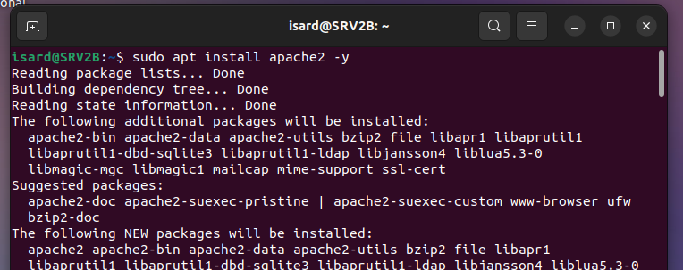
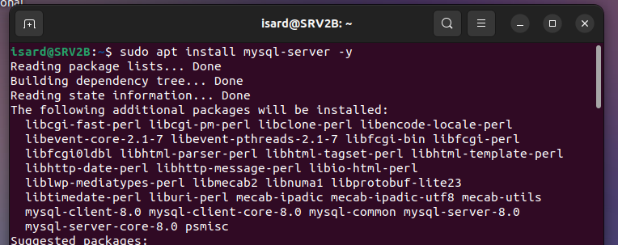
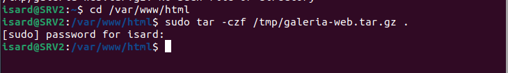
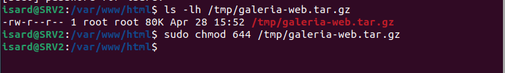
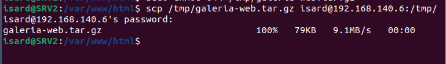
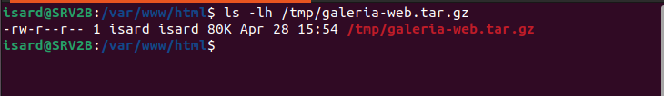
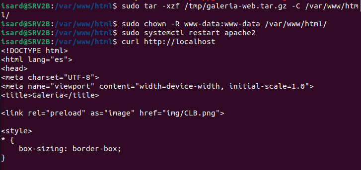

```markdown
# Configuración del Servidor Web Backup (SRV2B)

## Imagen 1 - Instalación de Apache2

**Donde se ejecuta:** Servidor Backup (SRV2B - 192.168.140.6)

**Comando:**
```bash
sudo apt install apache2 -y
```

**Que estamos haciendo:**
Instalando el servidor web Apache2 en el servidor backup (SRV2B). Este servidor actuara como respaldo del servidor web principal. Si el servidor principal falla, HAProxy redirigira el trafico a este servidor backup.



---

## Imagen 2 - Instalación de MySQL Server

**Donde se ejecuta:** Servidor Backup (SRV2B - 192.168.140.6)

**Comando:**
```bash
sudo apt install mysql-server -y
```

**Que estamos haciendo:**
Instalando MySQL Server en el servidor backup. La base de datos se replicara desde el servidor principal para que ambos servidores tengan los mismos datos y puedan funcionar de forma intercambiable.



---

## Imagen 3 - Compresion de la pagina web

**Donde se ejecuta:** Servidor Principal (SRV2 - 192.168.140.2)

**Comando:**
```bash
cd /var/www/html
sudo tar -czf /tmp/galeria-web.tar.gz .
```

**Que estamos haciendo:**
Comprimiendo toda la pagina web (Galería de Arte) que se encuentra en el directorio `/var/www/html/` del servidor principal (SRV2). El archivo comprimido se guarda en `/tmp/galeria-web.tar.gz` para poder copiarlo facilmente al servidor backup.



---

## Imagen 4 - Cambio de permisos del archivo comprimido

**Donde se ejecuta:** Servidor Principal (SRV2 - 192.168.140.2)

**Comando:**
```bash
sudo chmod 644 /tmp/galeria-web.tar.gz
```

**Que estamos haciendo:**
Cambiando los permisos del archivo comprimido a 644 (lectura y escritura para el propietario, solo lectura para los demas). Esto permite que el archivo pueda ser enviado a otro servidor mediante SCP sin problemas de permisos.



---

## Imagen 5 - Envio del archivo al servidor backup

**Donde se ejecuta:** Servidor Principal (SRV2 - 192.168.140.2)

**Comando:**
```bash
scp /tmp/galeria-web.tar.gz isard@192.168.140.6:/tmp/
```

**Que estamos haciendo:**
Enviando el archivo comprimido `galeria-web.tar.gz` desde el servidor principal (SRV2) al servidor backup (SRV2B con IP 192.168.140.6). El archivo se guarda en el directorio `/tmp/` del servidor backup.



---

## Imagen 6 - Verificacion de la llegada del archivo

**Donde se ejecuta:** Servidor Backup (SRV2B - 192.168.140.6)

**Comando:**
```bash
ls -lh /tmp/galeria-web.tar.gz
```

**Que estamos haciendo:**
Verificando que el archivo comprimido ha llegado correctamente al servidor backup. Comprobamos que el tamaño es de 80KB y que los permisos son correctos (rw-r--r--).



---

## Imagen 7 - Descompresion de la pagina web en el backup

**Donde se ejecuta:** Servidor Backup (SRV2B - 192.168.140.6)

**Comandos:**
```bash
sudo tar -xzf /tmp/galeria-web.tar.gz -C /var/www/html/
sudo chown -R www-data:www-data /var/www/html/
sudo systemctl restart apache2
curl http://localhost
```

**Que estamos haciendo:**
Descomprimiendo la pagina web en el directorio `/var/www/html/` del servidor backup. Luego cambiamos el propietario de los archivos a `www-data` y reiniciamos Apache. Finalmente verificamos con `curl http://localhost` que la pagina funciona correctamente en el servidor backup.




*Documentado por: Anmolpreet Singh Kaur & Spandan Khadka*
*Fecha: 04/05/2026*


- [Index](../Index.md)
