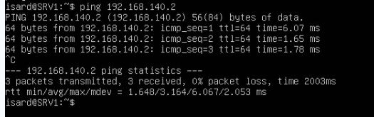
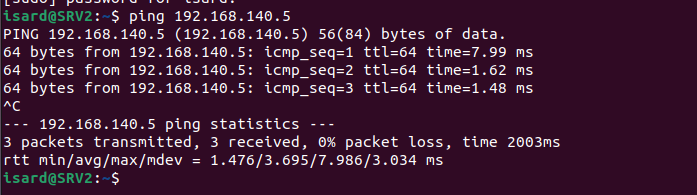

Here is the corrected version of your Markdown file in Spanish with proper formatting:

```markdown
# Configuración de Netplan - SRV2

## Archivo de configuración

**Ruta del archivo:** `/etc/netplan/00-installer-config.yaml`

## Contenido

```yaml
network:
  version: 2
  ethernets:
    enp1s0:
      dhcp4: true
    enp2s0:
      dhcp4: false
      addresses:
        - 192.168.140.2/24
```

# Configuración de Netplan - SRV1

```yaml
network:
  version: 2
  ethernets:
    enp1s0:
      dhcp4: true
    enp2s0:
      dhcp4: false
      addresses:
        - 192.168.140.5/24
```

## Comprobación de conectividad

Ping desde SRV1 a SRV2.



Ping desde SRV2 a SRV1.


```

- [Index](../Index.md)
