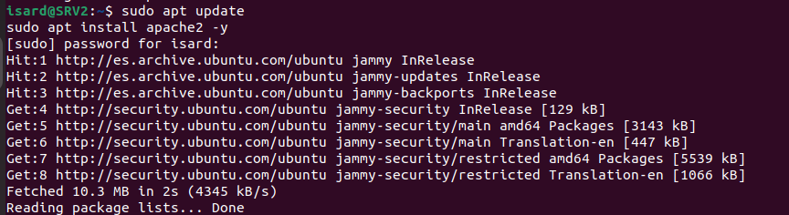
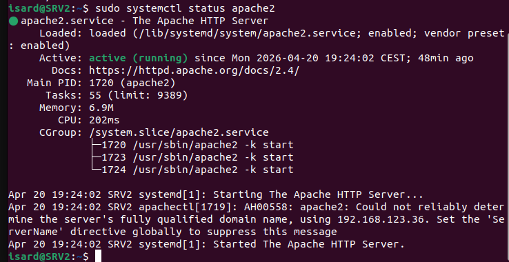
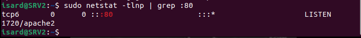
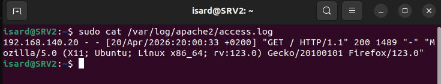
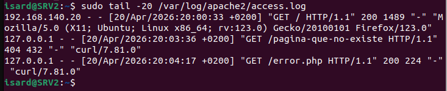

Here is the corrected and completed Markdown document:

```markdown
# Instalación de Apache2 - Servidor Web

## Objetivo
Instalar y configurar Apache2 en el servidor web (M1) para crear una página web que será monitorizada posteriormente por el SOC (Security Operations Center).

## Instalación de Apache2

```bash
sudo apt install apache2 -y
```



## Verificar Estado de Apache

```bash
sudo systemctl status apache2
```



## Verificar Puerto 80

```bash
sudo netstat -tlnp | grep :80
```



## Acceso a la Página Web

### Desde el mismo servidor
```bash
curl http://localhost
```

### Desde el navegador
```
http://192.168.140.2
```


## Logs de Apache

## Access Log (`/var/log/apache2/access.log`)
Registra **todas las peticiones** que recibe el servidor: quién se conectó (IP), qué solicitó (URL), cuándo, el código de respuesta (200, 404, etc.) y el tamaño de la respuesta.

# Ver access log

```bash
sudo tail -f /var/log/apache2/access.log
```



## Error Log (`/var/log/apache2/error.log`)
Registra **errores y problemas** del servidor: fallos internos (500), errores de configuración, archivos no encontrados, problemas de permisos o advertencias de módulos.

# Ver error log
```bash
sudo tail -f /var/log/apache2/error.log
```




- [Index](Index.md)
