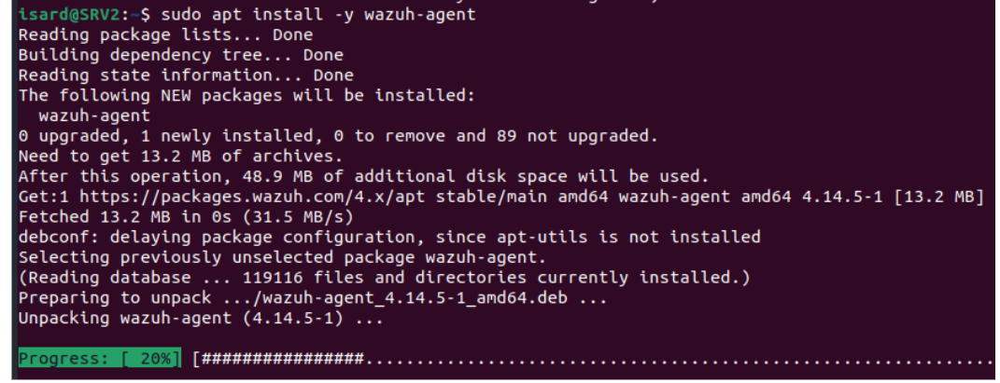
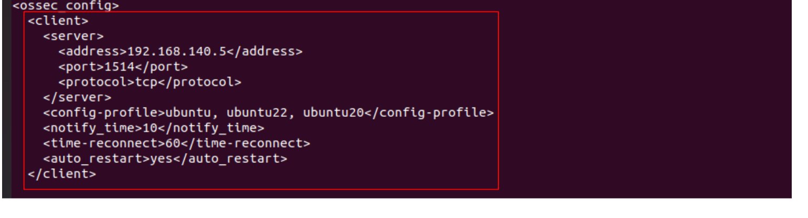
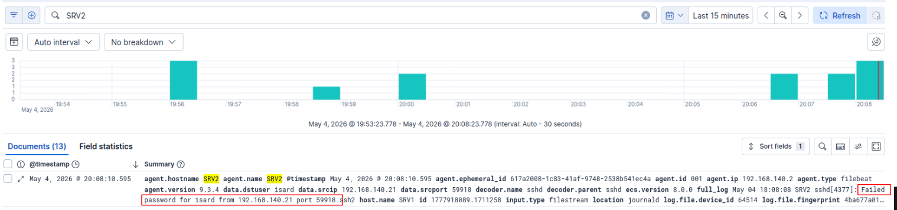

```markdown
# Instalación y Configuración de Agentes Wazuh

## Imagen 1 - Instalación del agente Wazuh en un cliente

**Donde se ejecuta:** Máquinas monitorizadas (SRV2_A, SRV2_B, clientes)

**Comando:**
```bash
sudo apt install -y wazuh-agent
```

**Que estamos haciendo:**
Instalamos el agente de Wazuh en cada una de las máquinas que queremos monitorizar. El agente se encarga de recoger logs del sistema, comandos ejecutados, cambios en archivos y actividad sospechosa, y enviarlos al Wazuh Manager para su análisis.



---

## Imagen 2 - Configuración de la conexión del agente con el Manager

**Donde se ejecuta:** Máquinas monitorizadas

**Archivo modificado:** `/var/ossec/etc/ossec.conf`

**Elemento distintivo de la imagen:**
```xml
<address>192.168.140.5</address>
<port>1514</port>
```

**Que estamos haciendo:**
Configuramos el agente para que se conecte al Wazuh Manager en la dirección IP `192.168.140.5` a través del puerto `1514` usando protocolo TCP. Esta es la dirección del servidor SOC donde se centralizan las alertas.



---

## Imagen 3 - Alerta de seguridad en Kibana (SSH failed password)

**Donde se visualiza:** Kibana - Interfaz web (http://192.168.140.5:5601)

**Elemento distintivo de la imagen:**
```
Failed password for isard from 192.168.140.21 port 5918
```

**Que estamos haciendo:**
Visualizamos en Kibana una alerta generada por Wazuh que muestra un intento de conexión SSH fallido. Esta alerta se ha generado porque el agente Wazuh en el servidor monitorizado ha detectado un evento de autenticación fallida y lo ha enviado al Manager, que a su vez lo ha indexado en Elasticsearch para su visualización en Kibana.

**Información que aporta la alerta:**
- Máquina afectada: SRV2
- IP de origen del ataque: 192.168.140.21
- Puerto de origen: 5918
- Usuario intentado: isard
- Regla aplicada: detección de contraseña fallida



---

## Resumen de los Agentes Desplegados

| Máquina | IP | Estado |
|---------|-----|--------|
| SRV2_A (Web principal) | 192.168.140.2 | Conectado |
| SRV2_B (Web backup) | 192.168.140.7 | Conectado |
| SRV1 (SOC) | 192.168.140.5 | Conectado |
| SRV0 (HAProxy) | 192.168.140.4 | Conectado |

---

*Documentado por: Anmolpreet Singh Kaur & Spandan Khadka*
*Fecha: 12/05/2026*
```