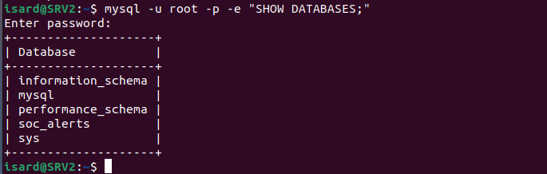
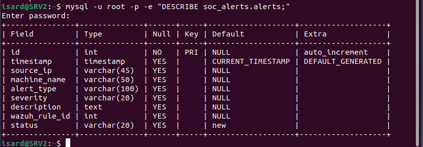
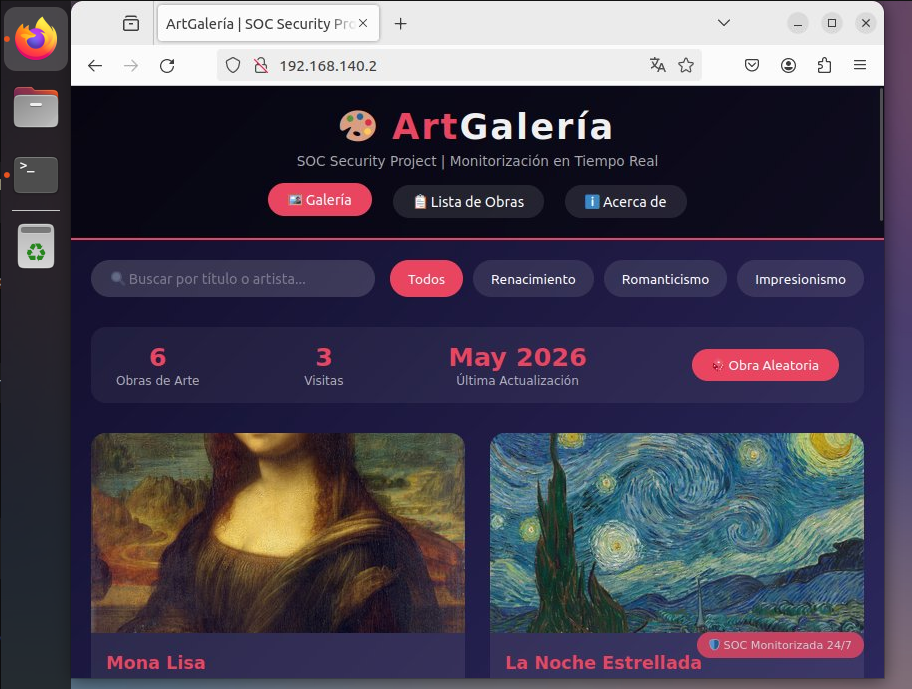
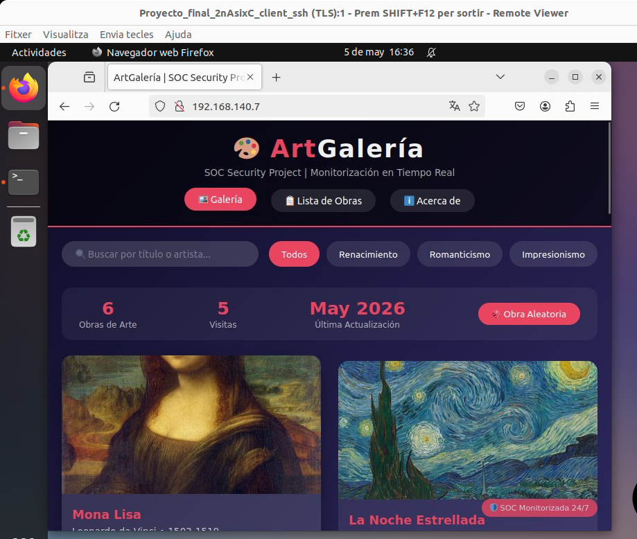

 # En esta parte, documentaremos todas las pruebas que realizamos durante el período de nuestro proyecto.

## Pruebas realizadas durante la configuración de la base de datos.

## 1. 



**Comando:**
```bash
mysql -u root -p -e "SHOW DATABASES;"
```

**Que estoy haciendo:**
Estoy listando todas las bases de datos en MySQL para verificar que la base de datos `soc_alerts` se haya creado correctamente.

**Por qué es necesario para nuestro proyecto:**
Esta comprobación es fundamental porque nuestro SOC necesita almacenar todas las alertas de seguridad en una base de datos estructurada. Sin la base de datos `soc_alerts`, no podríamos guardar las alertas generadas por Wazuh, ni mostrarlas en nuestro panel HTML personalizado. Verificar que la base de datos existe antes de continuar con la creación de tablas nos asegura que todo el sistema de almacenamiento de alertas funcionará correctamente.

**Que muestra esto:**
La base de datos `soc_alerts` aparece en la lista, lo que confirma que se creó correctamente. Las otras cuatro bases de datos son del sistema de MySQL y vienen por defecto.

**Conclusión:**
Esta verificación era necesaria para garantizar que nuestro SOC tendrá donde almacenar las alertas de seguridad. Si la base de datos no apareciese, significaría que hubo un error en su creación y tendríamos que crearla de nuevo antes de avanzar con el proyecto.

---

## 2.




**Comando:**
```bash
mysql -u root -p -e "DESCRIBE soc_alerts.alerts;"
```

**Qué estoy haciendo:**
Estoy mostrando la estructura de la tabla `alerts` dentro de la base de datos `soc_alerts` para verificar que se creó correctamente con todos los campos necesarios.

**Por qué es necesario para nuestro proyecto:**
Esta comprobación es fundamental porque la tabla `alerts` es donde se almacenarán todas las alertas de seguridad generadas por Wazuh. Necesitamos asegurarnos que la tabla tiene los campos correctos para guardar información como la IP del atacante, el tipo de alerta, la gravedad, la descripción y el estado de cada incidente. Sin una tabla bien estructurada, nuestro SOC no podría registrar ni gestionar las alertas de seguridad.

**Qué muestra esto:**
La tabla `alerts` tiene todos los campos que diseñamos:
- `id` como identificador único y automático
- `timestamp` para registrar cuándo ocurrió la alerta
- `source_ip` para guardar la IP del atacante
- `machine_name` para saber qué máquina fue atacada
- `alert_type` para clasificar el tipo de ataque
- `severity` para indicar la gravedad (Crítica, Alta, Media, Baja)
- `description` para detalles del ataque
- `wazuh_rule_id` para identificar la regla de Wazuh que detectó el ataque
- `status` con valor por defecto "new" para seguimiento de alertas

**Conclusión:**
Esta verificación era necesaria para confirmar que la tabla de alertas está correctamente estructurada antes de que el SOC comience a recibir y almacenar alertas reales. Si algún campo faltase o tuviese un tipo incorrecto, las alertas no se guardarían correctamente y el sistema fallaría.


# Pruebas realizadas durante la creación del Web Backup (SRV2B)


# 1.

## Contexto del Servidor Backup

Este servidor (SRV2B) actúa como respaldo del servidor web principal (SRV2). Su función es mantener la misma página web y la misma base de datos para que, si el servidor principal falla, HAProxy pueda redirigir automáticamente el tráfico hacia este servidor backup. De esta forma, la conexión con los usuarios se mantiene sin interrupciones.

---

## Explicación de la imagen

**Comando:**
```bash
curl http://localhost
```

**Qué estoy haciendo:**
Estoy probando que el servidor web backup (SRV2B) es capaz de servir la página web correctamente desde su propio directorio local.

**Por qué es necesario para nuestro proyecto:**
Esta comprobación es fundamental porque este servidor debe ser idéntico al servidor principal para que HAProxy pueda redirigir el tráfico sin problemas. Si el servidor backup no puede mostrar la página web correctamente, los usuarios experimentarían errores cuando el servidor principal fallase. Verificar que `curl http://localhost` devuelve el código HTML de la Galería de Arte nos asegura que el servidor backup está listo para asumir el servicio cuando sea necesario.

**Salida del comando:**
```html
<!DOCTYPE html>
<html lang="es">
<head>
<meta charset="UTF-8">
<meta name="viewport" content="width=device-width, initial-scale=1.0">
<title>Galería</title>

<link rel="preload" as="image" href="img/CLB.png">

<style>
* {
    box-sizing: border-box;
}
</style>
```

**Qué muestra esto:**
El servidor backup devuelve correctamente el código HTML de la página web. Vemos el título "Galería", la referencia a la imagen `img/CLB.png` y el estilo CSS. Esto confirma que:
- Apache está funcionando correctamente en el backup
- Los archivos de la página web se descomprimieron correctamente en `/var/www/html/`
- La página web es accesible localmente en el servidor backup

**Conclusión:**
Esta prueba confirma que el servidor backup está correctamente configurado y puede servir la misma página web que el servidor principal. Si el servidor principal (SRV2) falla, HAProxy puede redirigir el tráfico a este backup y los usuarios seguirán viendo la Galería de Arte sin interrupciones.

---

## Comando extraído

```bash
curl http://localhost
```


# Verificación de la Página Web en Servidores Principal y Backup

## Contexto

Tenemos dos servidores web configurados para nuestro proyecto SOC Security:
- **Servidor Principal (SRV2_A)**: IP 192.168.140.2
- **Servidor Backup (SRV2_B)**: IP 192.168.140.7

El servidor backup actúa como réplica exacta del principal. Si el servidor principal falla, HAProxy redirigirá automáticamente el tráfico al backup para que los usuarios no noten ninguna interrupción del servicio.

---

## Imagen 1 - Página Web del Servidor Principal (192.168.140.2)



**Características visibles:**
- Título: "ArtGalería"
- Subtítulo: "SOC Security Project | Monitorización en Tiempo Real"
- Menú de navegación: Galería, Lista de Obras, Acerca de
- Barra de búsqueda y filtros por categoría (Todos, Renacimiento, Romanticismo, Impresionismo)
- Contador: "6 Obras de Arte"
- Contador de visitas: "3 Visitas"
- Fecha de última actualización: "May 2026"
- Botón "Obra Aleatoria"
- Badge "SOC Monitorizada 24/7"

---

## Imagen 2 - Página Web del Servidor Backup (192.168.140.7)



**Características visibles:**
- Título: "ArtGalería"
- Subtítulo: "SOC Security Project | Monitorización en Tiempo Real"
- Menú de navegación: Galería, Lista de Obras, Acerca de
- Barra de búsqueda y filtros por categoría (Todos, Renacimiento, Romanticismo, Impresionismo)
- Contador: "6 Obras de Arte"
- Contador de visitas: "5 Visitas"
- Fecha de última actualización: "May 2026"
- Botón "Obra Aleatoria"
- Badge "SOC Monitorizada 24/7"
---

## Comandos utilizados para verificar

```bash
# Verificar servidor principal
curl -I http://192.168.140.2

# Verificar servidor backup
curl -I http://192.168.140.7

# Verificar página completa desde navegador
# Principal: http://192.168.140.2
# Backup: http://192.168.140.7
```
La única diferencia son las visitas, eso se debe a que he visitado el backup más veces que la página web del servidor principal, por lo que cuenta la cantidad de visitas.

*Documentado por: Anmolpreet Singh Kaur & Spandan Khadka*
*Fecha: 05/05/2026*


# Pruebas de Validación del SOC

## ¿Por qué hicimos estas pruebas?

Después de construir todo nuestro SOC, necesitábamos comprobar que funciona. Realizamos varios ataques simulados para ver si nuestro SOC detecta actividades sospechosas y genera alertas.

---

## Prueba 1: Intentos de SSH con usuario falso

**Comandos:**
```bash
ssh usuariofalso@192.168.140.1 -p 2222
ssh usuariofalso@192.168.140.1 -p 2223
ssh usuariofalso@192.168.140.1 -p 2224
ssh usuariofalso@192.168.140.1 -p 2225
```

**Qué hicimos:** Intentamos entrar por SSH a diferentes servidores con un usuario que no existe.

**Por qué es útil:** Los atacantes siempre prueban muchos usuarios y contraseñas para intentar entrar. Si nuestro SOC detecta estos intentos, podemos bloquear al atacante antes de que tenga éxito.

**Resultado:** Wazuh generó alertas por cada intento fallido.

---

## Prueba 2: Acceso a páginas web sospechosas

**Comandos:**
```bash
curl -k https://192.168.140.1/admin
curl -k https://192.168.140.1/wp-login.php
curl -k https://192.168.140.1/phpmyadmin
curl -k https://192.168.140.1/.env
```

**Qué hicimos:** Intentamos acceder a rutas web que suelen ser objetivo de atacantes (paneles de administración, archivos de configuración, etc.).

**Por qué es útil:** Los atacantes siempre buscan páginas de administración o archivos con información sensible. Si nuestro SOC detecta estos accesos, sabemos que alguien está explorando el sistema.

**Resultado:** Wazuh generó alertas por accesos a rutas no autorizadas.

---

## Prueba 3: Escaneo de puertos con Nmap

**Comandos:**
```bash
nmap -sV -Pn -p 443,2221,2222,2223,2224,2225 192.168.140.1
nmap -A -T4 -Pn 192.168.140.1
```

**Qué hicimos:** Usamos Nmap (una herramienta de escaneo muy usada por atacantes) para descubrir qué puertos están abiertos en nuestro firewall.

**Por qué es útil:** El escaneo de puertos es el primer paso de cualquier atacante. Necesitan saber qué puertos están abiertos antes de atacar. Detectar un escaneo nos permite identificar un ataque en sus etapas iniciales.

**Resultado:** Wazuh detectó el escaneo de puertos y generó alertas.

---

## Prueba 4: Intentos de FTP con usuario falso

**Comandos:**
```bash
ftp 192.168.140.1 2121
ftp 192.168.140.1 2122
ftp 192.168.140.1 2123
ftp 192.168.140.1 2124
ftp 192.168.140.1 2125
```

**Qué hicimos:** Intentamos conectar por FTP usando un usuario falso y contraseña incorrecta.

**Por qué es útil:** Los atacantes también prueban otros servicios como FTP buscando puntos débiles.

**Resultado:** Las conexiones fallaron porque no tenemos servicio FTP, y Wazuh registró estos intentos.

---

## Ejemplo de alerta en Kibana (SSH fallido)

**Qué vemos en la alerta:**

| Campo | Valor | Significado |
|-------|-------|-------------|
| `agent.hostname` | SRV2 | Máquina atacada |
| `data.srcip` | 192.168.140.21 | IP del atacante |
| `data.usr` | usuariofalso | Usuario que probaron |
| `rule.description` | SSH authentication failed | Tipo de alerta |

**Por qué es útil:** Esta alerta nos permite saber qué máquina está siendo atacada, desde qué IP, y qué usuario intentaron usar. Podemos bloquear esa IP inmediatamente.

---

## Resumen de pruebas

| Prueba | Tipo de ataque | Qué detecta |
|--------|----------------|-------------|
| SSH con usuario falso | Fuerza bruta | Alertas de SSH fallido |
| Acceso a rutas web sospechosas | Escaneo de directorios | Alertas de accesos no autorizados |
| Escaneo con Nmap | Reconocimiento de red | Alertas de port scanning |
| FTP fallido | Escaneo de servicios | Alertas de conexión denegada |

---

## Conclusión

Todas las pruebas funcionaron correctamente. Nuestro SOC detectó cada ataque simulado y generó alertas visibles en Kibana.

Esto demuestra que el SOC puede:
- Identificar ataques en tiempo real
- Mostrar la IP del atacante
- Saber qué máquina está siendo atacada
- Ayudar al administrador a tomar medidas

---

*Pruebas realizadas por: Anmolpreet Singh Kaur & Spandan Khadka*
*Fecha: 12/05/2026*


- [Index](../Index.md)

