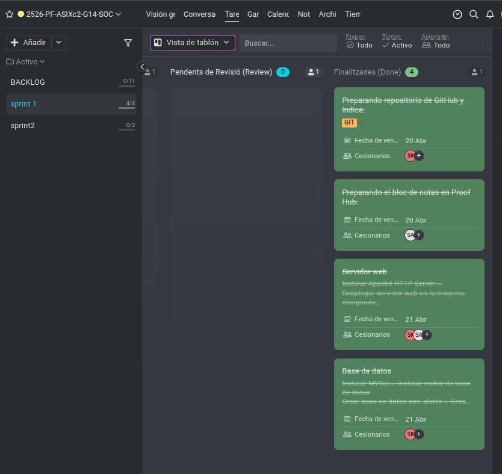

# Sprint 1 Review - SOC Security

## Fecha de la Review
27/04/2026

## Participantes

| Rol | Nombre |
|-----|--------|
| **Scrum Master** | Spandan (SK) |
| **Product Owner** | Anmolpreet (SA) |

---

## Resumen del Sprint 1

El Sprint 1 ha tenido una duración de 6 horas (del 20/04/2026 al 27/04/2026). El objetivo principal era establecer la base del proyecto SOC Security, incluyendo la creación del repositorio, la organización del backlog, la instalación del servidor web y la base de datos.

---

## Tareas Completadas (Done) - Sprint 1

Según nuestro ProofHub, estas son las tareas finalizadas durante el Sprint 1:

| Tarea | Descripción |
|-------|-------------|
| **Preparando repositorio de GitHub y índice** | GIT - Crear repositorio y estructura de documentación |
| **Preparando el bloc de notas en ProofHub** | Configurar el backlog y organizar tareas |
| **Servidor web** | Instalar Apache HTTP Server, desplegar servidor web en la máquina designada, crear página HTML básica |
| **Base de datos** | Instalar MySQL, instalar motor de base de datos, crear base de datos `soc_alerts` |
---

## Tareas No Completadas en Sprint 1

| Tarea | Motivo | Decisión |
|-------|--------|----------|
| **Diagrama de arquitectura** | Requería más tiempo para definir correctamente toda la arquitectura del SOC (load balancer, web servers, database, SOC server, clientes) | **Movido a Sprint 2** |

### Justificación de la decisión:

El diagrama de arquitectura no se completó en el Sprint 1 porque necesitábamos tener más claros todos los componentes del SOC antes de hacerlo. Al final del Sprint 1 ya tenemos claros los servicios instalados y podemos hacer un diagrama completo y correcto en el Sprint 2.

---

## Estado del ProofHub al Final del Sprint 1

| Columna | Tareas | Estado |
|---------|--------|--------|
| **Finalizadas (Done)** | 4 tareas |Completadas |
| **En curso (Doing)** | 0 tareas | - |
| **Pendientes (To Do)** | 0 tareas | - |
| **Diagrama** | 1 tarea | Movida a Sprint 2 |

---

## Entregables del Sprint 1

| Entregable | Estado | Ubicación |
|------------|--------|-----------|
| Repositorio GitHub |Completado | `README.md`, `Index.md` |
| Backlog ProofHub | Completado | Organizado por sprints |
| Servidor web (Apache) |Completado | `configuracion/conf_apache2.md` |
| Página web HTML |Completado | `configuracion/index_apache2.md` |
| Base de datos MySQL |Completado | `configuracion/conf_mysql.md` |
| Base de datos `soc_alerts` |Completado | Tabla `alerts` creada |
| Diagrama de arquitectura |Movido a Sprint 2 | Se completará en Sprint 2 |

---

*Documentado por: Anmolpreet Singh Kaur & Spandan Khadka*
*Fecha de la review: 27/04/2026*