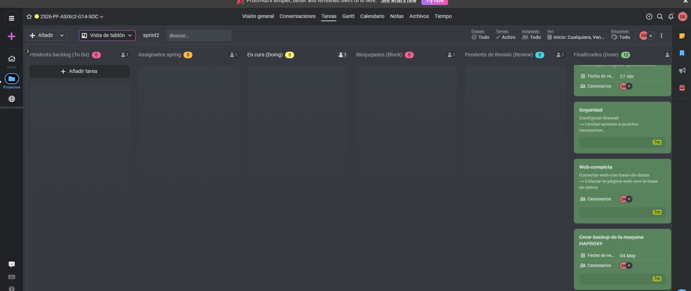

```markdown
# Sprint 2 Review - SOC Security (Sprint Final)

## Fecha de la Review
12/05/2026

## Participantes

| Rol | Nombre |
|-----|--------|
| Scrum Master | Spandan (SK) |
| Product Owner | Anmolpreet (SA) |

---

## Resumen del Sprint 2

El Sprint 2 ha sido el sprint final del proyecto (del 27/04/2026 al 12/05/2026). El objetivo era completar toda la infraestructura del SOC, incluyendo la configuración de HAProxy, la replicación de bases de datos, la instalación de Wazuh y Elastic Stack, la preparación de los agentes de monitorización, y todas las tareas pendientes del sprint anterior.

---

## Estado Final del ProofHub

| Columna | Tareas | Estado |
|---------|--------|--------|
| Finalizadas (Done) | 12 tareas | Completadas |
| En curso (Doing) | 0 tareas | Completadas |
| Pendientes (To Do) | 0 tareas | Completadas |
| Bloqueadas (Block) | 0 tareas | Completadas |

---

## Tareas Completadas en el Sprint Final

| Tarea | Descripción | Estado |
|-------|-------------|--------|
| Seguridad | Configurar firewall limitando acceso a puertos necesarios | Completado |
| Web completa | Conectar web con base de datos | Completado |
| Crear backup de la máquina HAProxy | Configurar HAProxy backup para failover manual | Completado |
| Arquitectura (diagrama) | Definir la arquitectura del proyecto y justificar las tecnologías elegidas | Completado |
| Preparación entorno | Crear todas las máquinas virtuales necesarias | Completado |
| Elastic Stack | Instalar Elasticsearch y configurar el motor de almacenamiento de logs | Completado |
| Wazuh | Instalar Wazuh Manager para la monitorización centralizada | Completado |
| Automatización | Crear script de estado de agentes | Completado |
| Logs | Instalar Filebeat y definir rutas de logs | Completado |
| Agentes | Desplegar agentes en las 4 máquinas monitorizadas | Completado |
| Validación SOC | Generar eventos de prueba y verificar alertas en Wazuh | Completado |
| Pruebas reales | Escaneo con Nmap y ataque de fuerza bruta SSH | Completado |

---

## Conclusión del Proyecto

**El proyecto SOC Security se ha completado con éxito.** Todos los objetivos planificados se han cumplido:

- Hemos construido una infraestructura completa con balanceador de carga, servidores web redundantes y base de datos replicada.
- Hemos implementado un firewall perimetral que controla todo el tráfico entrante.
- Hemos desplegado un SOC funcional con Wazuh, Elasticsearch y Kibana.
- Hemos monitorizado una aplicación web real (Galería de Arte) con usuarios y logins.
- Hemos realizado pruebas de seguridad (escaneo de puertos y fuerza bruta SSH) para validar el sistema.
- Hemos documentado todo el proceso en archivos Markdown.

El sistema está listo para ser utilizado como entorno de aprendizaje y demostración de un Centro de Operaciones de Seguridad.
```



*Documentado por: Anmolpreet Singh Kaur & Spandan Khadka*
*Fecha de la review final: 12/05/2026*

- [Index](../Index.md)
