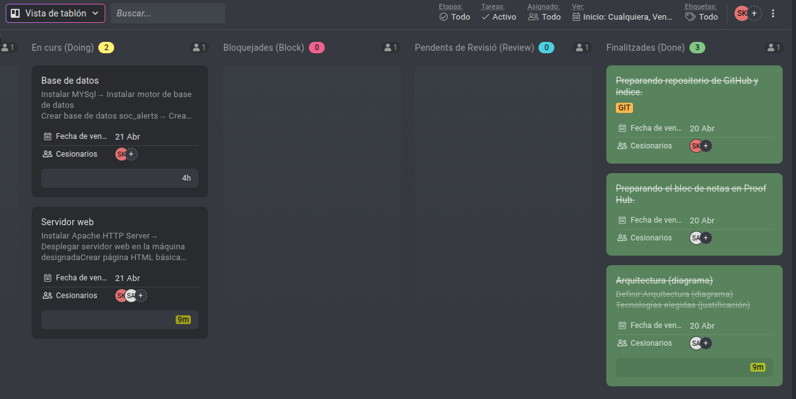

# Sprint 1: Base del Proyecto - Arquitectura, Documentación y Backlog

## Fecha de Inicio
21/04/2026

## Objetivo del Sprint

Poner en marcha la base del proyecto SOC Security. Esto incluye crear el entorno de trabajo, definir la arquitectura, instalar los servicios básicos y organizar las tareas en ProofHub.

---

## Planificación Inicial

Para comenzar nuestro proyecto, decidimos añadir estos tres elementos como base:

- Crear el diagrama de arquitectura
- Preparar la estructura de Git para la documentación
- Desglosar nuestro proyecto en tareas y añadirlas a nuestro backlog

Así es como se veía nuestro ProofHub al principio:

---

## Estado del Proyecto durante el Sprint

---

## ¿Qué hemos hecho hasta ahora?

### 1. Preparación del Entorno

- Creamos las máquinas virtuales en IsardVDI
- Configuramos las IPs estáticas y DHCP
- Verificamos la conectividad entre máquinas (ping)

### 2. Servidor Web (Apache)

- Instalamos Apache2 en SRV2
- Configuramos el firewall para abrir el puerto 80
- Creamos una página web temporal (Galería de Arte)
- Verificamos que la página es accesible desde el navegador

### 3. Base de Datos (MySQL)

- Instalamos MySQL server
- Configuramos la contraseña del usuario root
- Creamos la base de datos `soc_alerts`
- Creamos la tabla `alerts` con los campos necesarios
- Creamos el usuario `soc_user` con permisos limitados

### 4. Arquitectura y Documentación

- Definimos el diagrama de red del proyecto
- Decidimos usar IsardVDI como plataforma (comparativa vs AWS)
- Decidimos usar Apache como servidor web (comparativa vs Nginx)
- Creamos la estructura de carpetas en Git
- Documentamos todos los pasos en Markdown

---

## Resumen de Tareas Completadas

| Área | Tareas | Estado |
|------|--------|--------|
| Entorno | VMs creadas, red configurada | completo |
| Servidor web | Apache instalado, página funcionando |completo|
| Base de datos | MySQL instalado, tabla creada | completo |
| Documentación | Git, diagramas, comparativas | completo |

---

## Enlaces

- [Index](../Index.md)

---

*Documentado por: Anmolpreet Singh Kaur & Spandan Khadka*
*Fecha: 21/04/2026*