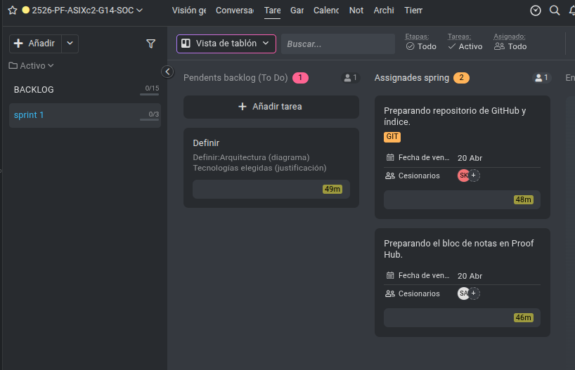

# Sprint 1: Base del Proyecto - Arquitectura, Documentación y Backlog

Para comenzar nuestro proyecto, decidimos añadir estos tres elementos como base de nuestro proyecto:

- Crear el diagrama de arquitectura
- Preparar la estructura de Git para la documentación
- Desglosar nuestro proyecto en tareas y añadirlas a nuestro backlog

Así es como se ve nuestro ProofHub por ahora.

- [Index](../Index.md)
